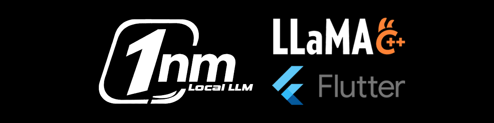

<p align="center">
  
</p>

<p align="center">
  <video src="flutter-llama.cpp/assets/demo.mp4" controls width="45%"></video>
  
</p>

# 1nm — Run AI locally in your mobile apps

[](LICENSE)

**Run powerful AI models directly on-device — in seconds, with just a few lines of code.**  
No cloud. No API keys. No latency. Fully offline.

---

## ⚡ What is 1nm?

1nm is a collection of lightweight SDKs that make it **easy to integrate local LLMs into mobile apps**.

Instead of dealing with native code, model loading, and platform differences —  
you get a **simple, clean API** that just works.

---

## 📦 Packages

| Package                                   | Platform | Language       | Status       |
| ----------------------------------------- | -------- | -------------- | ------------ |
| [`flutter-llama.cpp`](flutter-llama.cpp/) | Android  | Dart / Flutter | ✅ Available |
| `kotlin-llama.cpp`                        | Android  | Kotlin         | 🚧 Planned   |
| `swift-local-llm`                         | iOS      | Swift          | 🚧 Planned   |

> iOS support will use the most optimal runtime for the platform (not necessarily llama.cpp).

---

## 🚀 Quick Example

```dart
final ai = OneNm(model: OneNmModel.qwen25);
await ai.initialize();

final reply = await ai.chat('Hello!');
```

That’s it. You now have **on-device AI running inside your app**.

<p align="center">
  <video src="flutter-llama.cpp/assets/demo.mp4" controls width="35%"></video>
  
</p>

---

## 🔥 Why 1nm?

- ⚡ **Fast** — runs directly on-device
- 🔒 **Private** — no data leaves the user’s phone
- 💸 **Zero API cost** — no tokens, no billing
- 🧩 **Simple integration** — minimal setup, clean APIs
- 📱 **Built for mobile** — not a desktop tool forced onto phones

---

## 🧱 What it handles for you

- Model download & storage
- Native runtime integration
- Memory & performance handling
- Multi-turn chat

So you can focus on building features — not infrastructure.

---

## 📂 Repository Structure

```
onenm_local_llm/
├── flutter-llama.cpp/    # Flutter plugin (pub.dev: onenm_local_llm)
│   ├── lib/              # Dart API
│   ├── android/          # Native layer (Kotlin + C++)
│   ├── example/          # Demo apps
│   └── test/             # Tests
├── .github/
├── CONTRIBUTING.md
├── CODEOWNERS
└── LICENSE
```

---

## 🧪 Try it out

Start with Flutter:

👉 [`flutter-llama.cpp/README.md`](flutter-llama.cpp/README.md)

---

## 🛣 Roadmap

- Kotlin SDK
- iOS support
- More model options
- Performance improvements
- Additional language bindings

---

## 🤝 Contributing

We welcome contributions to improve onenm_local_llm! At this stage, contributions are limited to adding new models to the model registry, testing them. and other minor improvements.

See [CONTRIBUTING.md](CONTRIBUTING.md)

---

## 📜 License

MIT License — see [LICENSE](LICENSE)

llama.cpp is also licensed under MIT:
[https://github.com/ggml-org/llama.cpp/blob/master/LICENSE](https://github.com/ggml-org/llama.cpp/blob/master/LICENSE)
